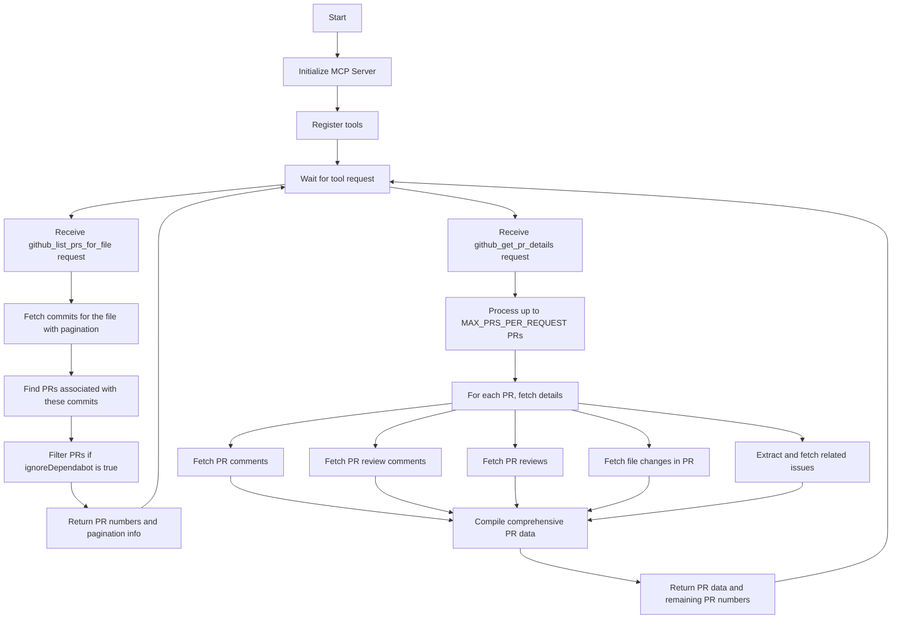

# GitHub DeepBlame MCP Server

A Model Context Protocol (MCP) server that provides tools to deeply analyze the history of a file in a GitHub repository. This server goes beyond standard git blame by retrieving comprehensive information about pull requests that modified a specific file, including:

- Pull request details
- Comments
- Review comments
- Reviews
- File changes
- Issues

## Requirements

- Node.js
- GitHub Personal Access Token with appropriate permissions

## Installation

```bash
# Clone the repository
git clone https://github.com/gtnao/github_deep_blame_mcp.git
cd github_deep_blame_mcp

# Install dependencies
npm install

# Build the project
npm run build
```

## Configuration

To use this MCP server with Claude or other MCP-compatible AI assistants, you need to add it to your MCP configuration file:

```json
{
  "mcpServers": {
    "github_deep_blame": {
      "command": "node",
      "args": ["<your_path>/build/index.js"],
      "env": {
        "GITHUB_TOKEN": "<your_personal_access_token>"
      }
    }
  }
}
```

Replace `<your_path>` with the absolute path to the build/index.js file in your cloned repository, and `<your_personal_access_token>` with your GitHub Personal Access Token.

### GitHub Token

You need to create a GitHub Personal Access Token with the following permissions:

- `repo` (Full control of private repositories)

You can create a token at: https://github.com/settings/tokens

## Usage

Once configured, you can use the tools in your MCP-compatible AI assistant. The process is a two-step workflow:

### Step 1: List PRs for a file

First, use the `github_list_prs_for_file` tool to find all PRs that modified a specific file:

```
<use_mcp_tool>
<server_name>github_deep_blame</server_name>
<tool_name>github_list_prs_for_file</tool_name>
<arguments>
{
  "owner": "username",
  "repo": "repository-name",
  "path": "path/to/file.js",
  "page": 1,
  "since": "2023-01-01T00:00:00Z",
  "until": "2023-12-31T23:59:59Z"
}
</arguments>
</use_mcp_tool>
```

You may need to make multiple requests with different page numbers to collect all PRs if `has_more` is true in the response.

### Step 2: Get PR details

After collecting all PR numbers from `github_list_prs_for_file` (possibly making multiple requests if `has_more` is true), use the `github_get_pr_details` tool to get detailed information about those PRs:

```
<use_mcp_tool>
<server_name>github_deep_blame</server_name>
<tool_name>github_get_pr_details</tool_name>
<arguments>
{
  "owner": "username",
  "repo": "repository-name",
  "pr_numbers": [123, 456, 789, ...], // All PR numbers collected from github_list_prs_for_file
  "path": "path/to/file.js"
}
</arguments>
</use_mcp_tool>
```

The tool implements pseudo-pagination: initially send all PR numbers collected from `github_list_prs_for_file`. If the response includes `remaining_pr_numbers`, send those in a subsequent request:

```
<use_mcp_tool>
<server_name>github_deep_blame</server_name>
<tool_name>github_get_pr_details</tool_name>
<arguments>
{
  "owner": "username",
  "repo": "repository-name",
  "pr_numbers": [789, 101, ...], // The remaining_pr_numbers from the previous response
  "path": "path/to/file.js"
}
</arguments>
</use_mcp_tool>
```

Continue this process until there are no more `remaining_pr_numbers` in the response.

### Parameters

#### github_list_prs_for_file

- `owner`: The owner (user or organization) of the repository
- `repo`: The name of the repository
- `path`: The path to the file in the repository
- `page`: The page number for commits pagination (default: 1)
- `since`: Only show commits after this timestamp (ISO 8601 format)
- `until`: Only show commits before this timestamp (ISO 8601 format)
- `ignoreDependabot`: Whether to ignore PRs created by Dependabot (default: true)

#### github_get_pr_details

- `owner`: The owner (user or organization) of the repository
- `repo`: The name of the repository
- `pr_numbers`: Array of PR numbers to get details for
- `path`: (Optional) The path to the file in the repository for file-specific details

## How It Works



## Dependencies

- `@modelcontextprotocol/sdk`: MCP server SDK
- `@octokit/rest`: GitHub REST API client
- `zod`: Schema validation
- `zod-to-json-schema`: Convert Zod schemas to JSON Schema

## License

MIT
