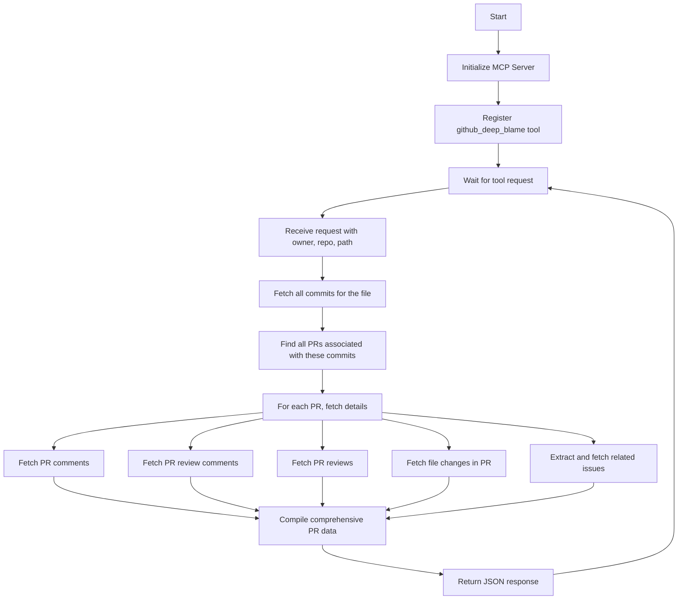

# GitHub DeepBlame MCP Server

A Model Context Protocol (MCP) server that provides a tool to deeply analyze the history of a file in a GitHub repository. This tool goes beyond standard git blame by retrieving comprehensive information about pull requests that modified a specific file, including:

- Pull request details
- Comments
- Review comments
- Reviews
- File changes
- Issues

## Requirements

- Node.js
- GitHub Personal Access Token with appropriate permissions

## Installation

```bash
# Clone the repository
git clone https://github.com/gtnao/github_deep_blame_mcp.git
cd github_deep_blame_mcp

# Install dependencies
npm install

# Build the project
npm run build
```

## Configuration

To use this MCP server with Claude or other MCP-compatible AI assistants, you need to add it to your MCP configuration file:

```json
{
  "mcpServers": {
    "github_deep_blame": {
      "command": "node",
      "args": ["<your_path>/build/index.js"],
      "env": {
        "GITHUB_TOKEN": "<your_personal_access_token>"
      }
    }
  }
}
```

Replace `<your_path>` with the absolute path to the build/index.js file in your cloned repository, and `<your_personal_access_token>` with your GitHub Personal Access Token.

### GitHub Token

You need to create a GitHub Personal Access Token with the following permissions:

- `repo` (Full control of private repositories)

You can create a token at: https://github.com/settings/tokens

## Usage

Once configured, you can use the `github_deep_blame` tool in your MCP-compatible AI assistant:

```
<use_mcp_tool>
<server_name>github_deep_blame</server_name>
<tool_name>github_deep_blame</tool_name>
<arguments>
{
  "owner": "username",
  "repo": "repository-name",
  "path": "path/to/file.js"
}
</arguments>
</use_mcp_tool>
```

### Parameters

- `owner`: The owner (user or organization) of the repository
- `repo`: The name of the repository
- `path`: The path to the file in the repository

## How It Works



## Dependencies

- `@modelcontextprotocol/sdk`: MCP server SDK
- `@octokit/rest`: GitHub REST API client
- `zod`: Schema validation
- `zod-to-json-schema`: Convert Zod schemas to JSON Schema

## License

MIT
